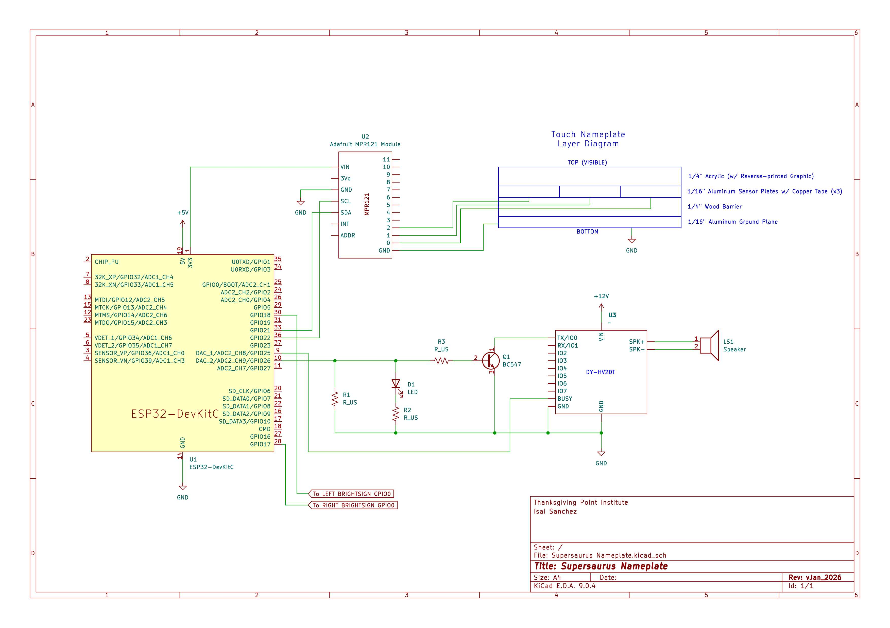

# Dino Nameplate

https://github.com/user-attachments/assets/d761b371-b2cf-4e69-9180-89696157810f

## Overview

The capacitive touch sensing firmware for the Supersaurus nameplate of the Rise of the Giants exhibit at Thanksgiving Point. Features a custom MPR121 class, extended from [Adafruit's MPR121 Library](https://github.com/adafruit/Adafruit_MPR121), that configures baseline tracking registers, applies ema filtering to ensure touch events are detected with thick acrylic overlays, and has additional logic that triggers video and sound playback efficiently.

## Hardware

- **[Adafruit MPR121](https://www.adafruit.com/product/1982?gad_source=1&gad_campaignid=21079227318&gbraid=0AAAAADx9JvQkAsO7RS9bBB6XvtT1bf9lk&gclid=CjwKCAiAz_DIBhBJEiwAVH2XwDNIsjXkWfC8uAxjFRL1-COz-OxQyJIywEJ_eRMTO43w4skTKTorZRoCbN8QAvD_BwE)** - 12-channel capacitive touch sensor breakout
- **[SparkFun Pro Micro ESP32-C3](https://www.sparkfun.com/sparkfun-pro-micro-esp32-c3.html)** - Microcontroller with native USB and UART
- **DY-HV20T** - 20W audio playback module for triggered sound effects
- **Touch Pads** - 3x 1/16" aluminum plates covered with copper tape for ease of soldering (see `docs/` for more info on construction)

## Wiring Diagram

## Software Architecture

### Overview

The source code MVP is the custom MPR121 class which includes:

- Enhanced filtering for touch sensing on thick 0.2" acrylic overlay
- Stubborn baseline tracking to prevent immediate drift during touch events

### Custom MPR121 Class

This project extends the [Adafruit MPR121 Library](https://github.com/adafruit/Adafruit_MPR121) to provide exhibit-specific configuration. Default baseline parameters and more were not sufficient for the installation.

### Custom `begin()` Function

Our modified `begin()` method configures the MPR121 for better performance with thick overlays:

- **Baseline Tracking**:
- **Recovery Speed**:
