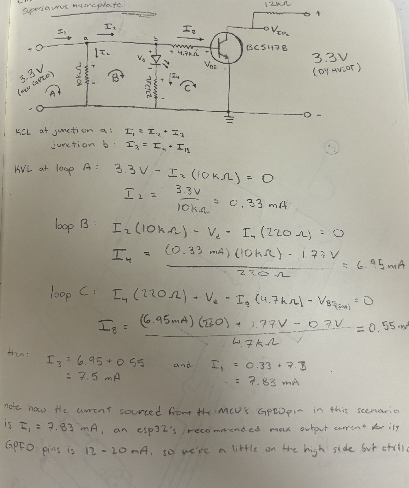

# Bone Interactive Docs

## Maintenance Notes

### Power Up Calibration Lock

When the cabinet is closed, the electrode wires are pressed against the TV surface, which affects their capacitive behavior and touch calibration. Because of this, calibration must always occur with the cabinet fully closed to ensure reliable touch sensing. To enforce this, I added a 10s delay on power-up before calibration begins. After maintenance is finished, the user must press the ESP32 RST button (or power-cycle the ESP32) and promptly close the cabinet to allow the system to complete calibration in its normal, closed-cabinet state. This procedure must be repeated every time the cabinet is opened.

### Why a BJT?

The DY-HV20T used in this installation is the active low-level trigger version, meaning each IOx trigger pin is internally pulled up to 3.3V through a ~12k resistor, and a sound is triggered when the pin is driven low. If any ESP32 GPIO pin were connected directly to a trigger pin, a failure or power-off condition of the ESP32 could inadvertently pull the trigger line low (due to internal protection diodes on the esp32 side combined with the modules pull up resistor) resulting in an unintended continuous trigger and sound playback loop (luckily this problem came to light during testing).

To prevent this failure mode, I leveraged the BC547B npn BJT to act as a low side switch. Whenever we DO want to play a sound, the ESP32 would drive current through the BJT's base through a 4.7k resistor, turning the transistor on and actively pulling the trigger pin low (see picture below for circuit analysis). In all other cases (ESP32 powered off, reset, or sending a LOW signal) the BJT would remain off, leaving the trigger pin pulled high (preventing any sound from playing). This approach ensures that sounds are only triggered intentionally.

